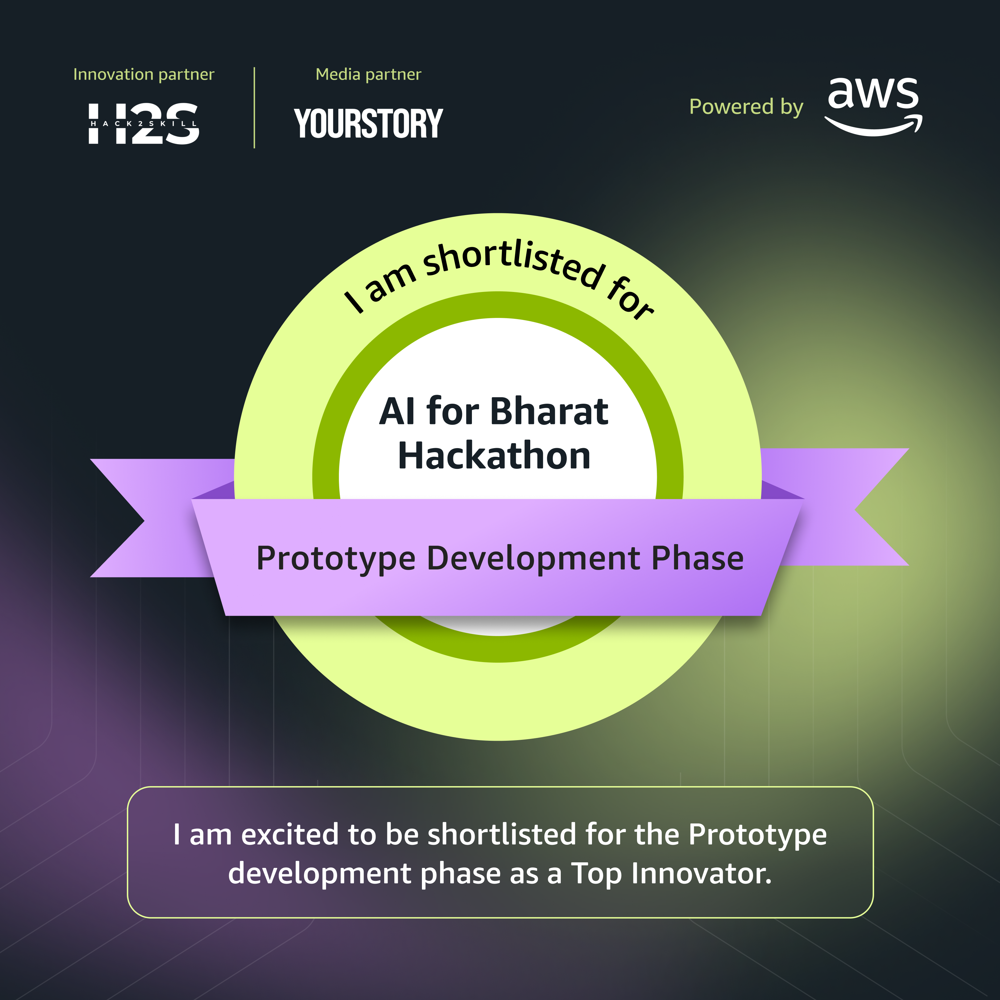

<div align="center">

# Anshu Raj Bisoyi


**Software Developer · Backend & Cloud · Applied AI**

B.Tech CSE (AI & ML) · Mirai School of Technology / AKTU · Class of 2029

[](https://linkedin.com/in/anshu-raj-bisoyi-11618a371)
[](mailto:anshurajbisoyi98@gmail.com)
[](https://leetcode.com/u/leetcode_joe/)


</div>

---

## 👨‍💻 About Me

```python
class Anshu:
    name = "Anshu Raj Bisoyi"
    based_in = "Ghaziabad, India"
    education = "B.Tech CSE (AI & ML), 2025–2029"
    building_with = ["JavaScript", "TypeScript", "Python", "Node.js"]
    interests = ["Backend Engineering", "Serverless AI", "Open Source"]
    current_focus = "Build useful applications and improve through real fixes"
    beyond_code = ["Club leadership", "NCC", "Chess"]
```

I build web applications and explore how cloud infrastructure and AI can solve practical problems. My projects range from **MongoDB-backed CRUD workflows** to **browser-side image tools** and **AWS serverless navigation**.

---

<a id="margmitra"></a>

## ☁️ AWS AI for Bharat Hackathon — MargMitra

**Participated with MargMitra and shortlisted for the Prototype Development Phase.**

MargMitra is an AI-powered navigation project aimed at helping rural users access natural-language route guidance, including in areas with limited connectivity. The project brings together **AWS Lambda, AWS Bedrock, Python, JavaScript, and serverless architecture**.

<div align="center">



</div>

---

## 🚀 Featured Projects

| Project | What it does | Built with | Explore |
| :--- | :--- | :--- | :--- |
| 🚗 **Mustang Experience & Service Concierge** | Combines a cinematic automotive interface with vehicle records, service booking, maintenance reminders, and customer/admin workflows. | JavaScript · Vite · Node.js · Express · MongoDB | [Source](https://github.com/anshurajbisoyi98-ctrl/cargarage) |
| ♻️ **E-Waste Recycler** | Connects citizens, collection agents, and administrators through pickup scheduling, recycling status tracking, and a points-based reward wallet. | React · Node.js · Express · MongoDB | [Source](https://github.com/anshurajbisoyi98-ctrl/sundayassignment) |
| 🖼️ **HH Goa Frame Generator** | Creates personalized profile frames and builder ID cards, with local image processing, HEIC support, and PNG export. | React · TypeScript · Tailwind · Canvas | [Source](https://github.com/anshurajbisoyi98-ctrl/hackathonprojectgoa) · [Live app ↗](https://hackathonprojectgoa.vercel.app) |
| 🎮 **Isometric Android Game Prototype** | Renders an isometric scene with buildings, draggable placement, camera panning, and pinch-to-zoom controls. | Kotlin · Android SurfaceView · Canvas | [Source](https://github.com/anshurajbisoyi98-ctrl/26marchhackathon) |
| 🏥 **Hospital Management System** | Manages patient records with create, search, update, and delete workflows, MVC organization, and request logging. A learning project. | Node.js · Express · MongoDB · EJS | [Source](https://github.com/anshurajbisoyi98-ctrl/WEB_ASSIGNMENT) |
| 🧭 **MargMitra** | AI-powered navigation for rural users; AWS AI for Bharat Hackathon participant, shortlisted for prototype development. | AWS Lambda · Bedrock · Python · JavaScript | [Hackathon highlight](#margmitra) |

---

## 🛠️ Tech Stack

<div align="center">


</div>

| Focus | Additional experience |
| :--- | :--- |
| **Backend & data** | Mongoose, REST API integration, EJS, MVC architecture, SQL |
| **Cloud & AI** | S3, serverless architecture, generative AI, prompt engineering |
| **Analysis & fundamentals** | NumPy, Pandas, Matplotlib, C++ fundamentals, data structures & algorithms |

---

## 🌍 Open Source
| Project | Contribution | Status |
| :--- | :--- | :--- |
| **Mycelium** | Rejected boolean `budget.warn_at` values in both YAML loading and runtime configuration, with regression tests for invalid and valid thresholds. | 
| **TurboHTML** | Fixed `inner_html` for HTML `frame` elements to ignore void-element children while preserving SVG and MathML `frame` children; added regression tests, documentation, and changelog entry. | [Merged PR #1008](https://github.com/tox-dev/turbohtml/pull/1008) |
| **Open Vids** | Fixed Node 25+ player test failures by disabling Node's experimental web storage so happy-dom provides the expected browser `localStorage`, without changing production code. | [Merged PR #18](https://github.com/bazodev/open-vids/pull/18) |
[Merged PR #257](https://github.com/mycelium-labs/mycelium/pull/257) |
| **Meshery** | Added a contributor introduction describing my background as a Computer Science student, interests in AI/ML and full-stack development, and approach to learning and collaboration. | [Merged PR #22080](https://github.com/meshery/meshery/pull/22080) |

## 📊 GitHub Stats

<div align="center">


</div>

---

## 🏆 Beyond the Code

- ☁️ **AWS AI for Bharat Hackathon:** participated with MargMitra and shortlisted for the Prototype Development Phase.

- 🥇 **1st place — Scrap to Scale Ideathon (2025):** research, market analysis, and team pitch at Mirai School of Technology.
- 🧠 **150+ LeetCode problems solved**, as recorded in my resume; continuing to practice data structures and algorithms.
- 🎭 **President — Malhar Cultural Club:** coordinated teams and events, including a comedy night with 100+ participants.
- 🎖️ **NCC A & B certificates:** leadership, discipline, and teamwork through cadet training.

---

## 🤝 Let's Connect

<div align="center">

Interested in building a web application, exploring applied AI, or collaborating on open source?

[](https://linkedin.com/in/anshu-raj-bisoyi-11618a371)
[](mailto:anshurajbisoyi98@gmail.com)
[](https://github.com/anshurajbisoyi98-ctrl)
[](https://codeforces.com/profile/leetcode_joe)

**Build with curiosity. Learn through practice. Contribute with care.**

</div>
